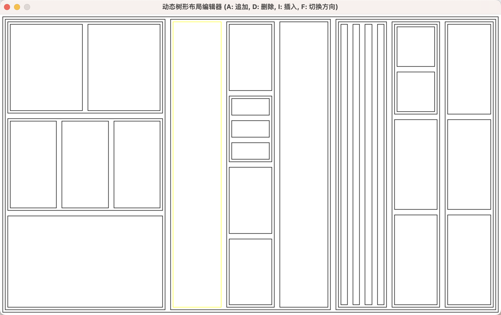
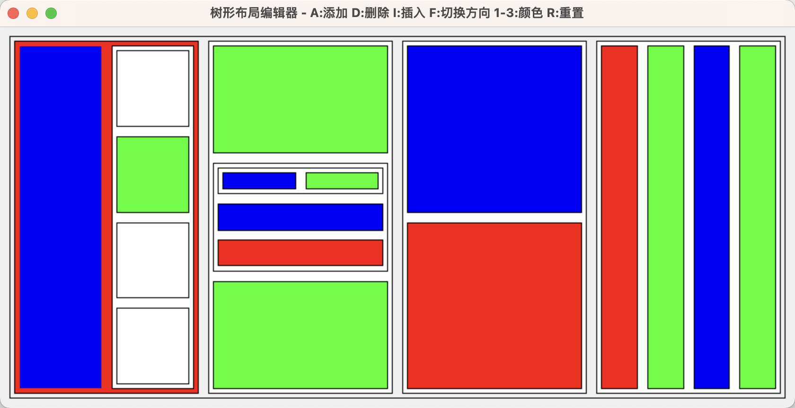
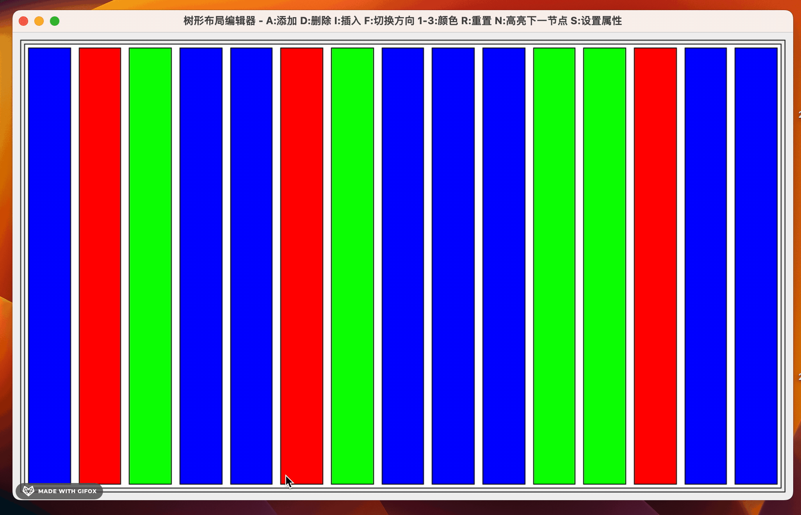
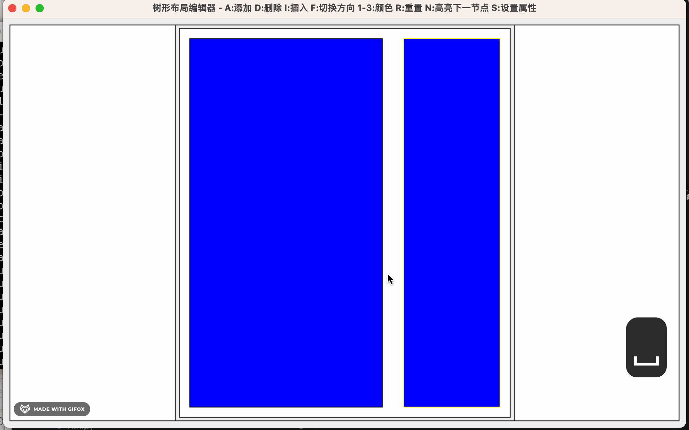
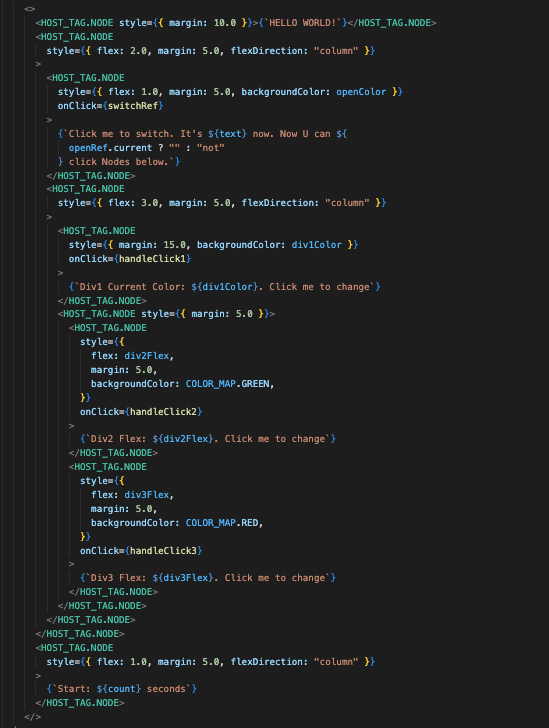
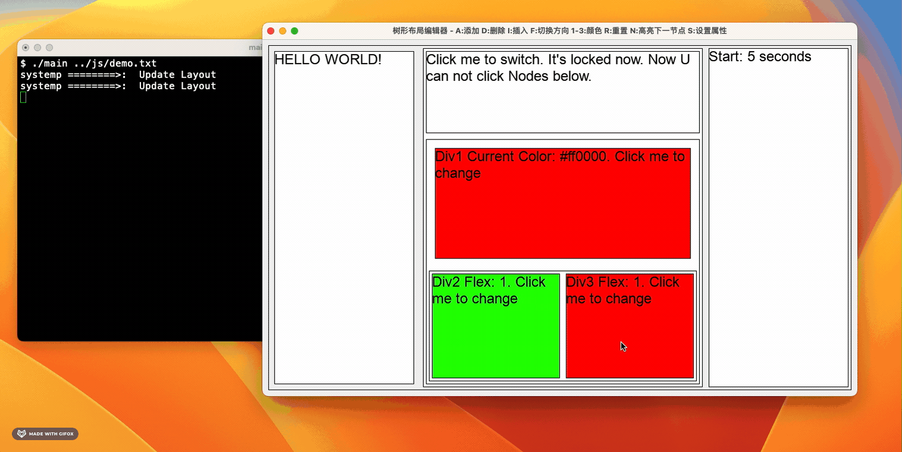

### install sdl2
```
brew install sdl2
```

### build yoga
```
cd yoga/yoga

mkdir build

cd build

cmake ..

make
```

### build quickjs
```
cd slowjs

cmake -S . --preset=default -D CMAKE_BUILD_TYPE=Release

```


### build project
```
mkdir build

cd build

cmake ..

make
```

### build react-reconciler
```
cd yoda-react-reconciler

pnpm install

npm run build

move dist/*.js ../js/
```

### run
```
cd build

// rename demo.js to your own file, e.g. demo.txt
./main ../js/demo.txt   
```

### preview

#### v0.0.0



#### v0.1.0



### v0.2.0  

Use React to Build APP

https://github.com/LeeeeeeM/yoda-react-reconciler


